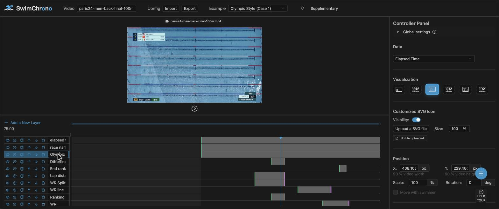

# SwimChrono

This is a repository for original codes of an authoring tool, *SwimChrono*, provided in the paper ["Diving Deep into Time: Temporal Arrangements for Embedded Visualization in Swimming Videos"](https://doi.org/10.1109/TVCG.2026.3689361) ([preprint on HAL](https://hal.science/hal-05612503)), published at [IEEE Transactions on Visualization and Computer Graphics](https://www.computer.org/csdl/journal/tg).
*SwimChrono* lets users author embedded visualizations on top of swimming-race videos — pick a race, select data fields, attach visualizations to lanes or screen corners, edit each element's style, and define triggers (manually or via the built-in AI assistant) that decide when each layer appears. An online interactive version can be accessed at https://aviz.gitlabpages.inria.fr/swimchrono/ or https://ahugh19.github.io/SwimChrono/.

See also [*SwimFlow*](https://aviz.gitlabpages.inria.fr/vis-in-motion-swimflow/), our related tool for embedded visualizations in swimming videos.



## Documentation & Materials

* [Adding a new video](./docs/adding-a-video.md) — step-by-step instructions, a copy/paste metadata template, and notes on the data-processing pipeline.
* [The speed-climbing case](./docs/climbing-case.md) — an experimental demonstration that the approach generalizes beyond swimming.
* [Supplementary materials on OSF](https://osf.io/t82cw/overview) — materials accompanying the paper.

If you use *SwimChrono* and our results on **temporal arrangements for embedded visualization** in new projects or use it in a different way, we would appreciate a citation:

* Junxiu Tang, Lijie Yao, Lu Ying, Romain Vuillemot, Petra Isenberg. Diving Deep Into Time: Temporal Arrangements for Embedded Visualization in Swimming Videos. IEEE Transactions on Visualization and Computer Graphics, 32(7):6825–6841, 2026. doi: [10.1109/TVCG.2026.3689361](https://doi.org/10.1109/TVCG.2026.3689361). [Preprint on HAL](https://hal.science/hal-05612503).

    ```
    @ARTICLE{11501810,
        author={Tang, Junxiu and Yao, Lijie and Ying, Lu and Vuillemot, Romain and Isenberg, Petra},
        journal={IEEE Transactions on Visualization and Computer Graphics},
        title={Diving Deep Into Time: Temporal Arrangements for Embedded Visualization in Swimming Videos},
        year={2026},
        volume={32},
        number={7},
        pages={6825-6841},
        doi={10.1109/TVCG.2026.3689361}}
    ```

## Local Deployment

1. Install necessary tools like `node.js` and `yarn`.

2. Install node_modules for front end:
   ```bash
   yarn
   ```

3. Run the system front end at the project root `./`:
   ```bash
   yarn run dev
   ```

4. The system is usually served on [http://localhost:5173/SwimChrono/](http://localhost:5173/SwimChrono/).

To build the project, run:
```bash
yarn run build
```
The built files are in `./dist`.

## Configure the AI Assistant (optional)

The TriggerDrawer's "AI Interpret" button calls a chat-completion API to
turn natural-language descriptions into trigger configs. **No API key
ships with this repository — you must supply your own.**

1. Copy `.env.example` to `.env` (gitignored — never committed):
   ```bash
   cp .env.example .env
   ```
2. Fill in `VITE_AI_API_KEY` and, if needed, `VITE_AI_BASE_URL` /
   `VITE_AI_MODEL`. Without a key the AI button shows a warning instead
   of dispatching a request.
3. Restart `yarn run dev` so Vite picks up the new env vars.

### Provider compatibility

The client uses the [`openai`](https://www.npmjs.com/package/openai) SDK
with a configurable `baseURL`, so any **OpenAI-compatible** chat-completion
endpoint works without code changes:

| Provider | `VITE_AI_BASE_URL` | Example `VITE_AI_MODEL` | Works out of the box |
|---|---|---|---|
| DeepSeek | `https://api.deepseek.com` | `deepseek-chat` | Yes |
| OpenAI | `https://api.openai.com/v1` | `gpt-4o-mini` | Yes |
| Together AI | `https://api.together.xyz/v1` | `mistralai/Mixtral-8x7B-Instruct-v0.1` | Yes |
| Groq | `https://api.groq.com/openai/v1` | `llama-3.1-70b-versatile` | Yes |
| Anthropic Claude | n/a — Messages API is not OpenAI-shaped | `claude-3-5-sonnet-latest` | **Needs adapter** (add `@anthropic-ai/sdk` and a small wrapper in `src/utils/aiConfig.ts`) |
| Google Gemini | n/a — uses its own protocol | `gemini-1.5-pro` | **Needs adapter** (add `@google/generative-ai` and a wrapper) |

> Keys placed in `.env` are bundled into the front-end and visible to any
> page visitor. Use a key scoped to client-side usage and rotate it
> regularly. For production, proxy the request through a backend you
> control instead of shipping the key.

## Tests

Component regression tests run with [Vitest](https://vitest.dev/) +
`@testing-library/react` + `jsdom`.

```bash
yarn test         # run once
yarn test:watch   # watch mode
```

The test setup lives in `vitest.config.ts` and `src/test/`. Tests sit
next to the components they cover, named `index.test.tsx`.

## Project Layout

```
public/
├── configuration/   # exportable layer-config JSON examples (olympic, pacman, acc, …)
├── csv/             # per-race frame data (one row per swimmer per frame)
├── video/           # compressed mp4s referenced from videoMetaDataList
├── img/             # icons used by the visualization picker
├── font/            # OlympicStyle font for badge text
└── labelTool/       # backing data for the label tool's existing-data fetch

src/
├── pages/           # route entries (Home, LabelTool, Visualization)
├── components/
│   ├── Header/                 # video selection, import/export, examples
│   ├── VideoPanel/VisHolder/   # SVG layers driven by frame data:
│   │   ├── VisAlongLane/       # per-lane visualizations
│   │   └── VisGlobal/          # screen-corner / global visualizations
│   ├── LayerPanel/             # Konva timeline, layer list, TriggerDrawer + AIChat
│   ├── ControllerPanel/        # data / vis / position / element editors
│   ├── VideoLabel/             # labelling tool (vis / event / camera shot)
│   └── ResultVisualization/    # cross-race statistics gantt
├── store/           # MobX root store
├── tool/            # CanvasSelect (rect / polygon / point / line / circle annotator)
├── types/           # shared types + zod schema for imported configurations
├── utils/           # values, prompts, flag SVGs, helpers
└── test/            # vitest setup + shared fixtures
```

## Editing-element contract

Each visualization advertises an editable element list in
`utils/values.tsx → editableElementInVisConfig`. The `ControllerPanel`
exposes editors based on the element's `type` (`text` / `shape` / `icon` /
`color`); the matching component reads those styles back through
`editableElementList` and applies `visible` / `x` / `y` / `fontSize` /
`fontFillColor` / `shapeFillColor` / `shapeStrokeColor` / `shapeStrokeWidth`
/ `iconSize` to its rendered SVG. Regression tests in
`src/components/.../*.test.tsx` pin this contract.

## License

MIT — see [LICENSE](./LICENSE).
