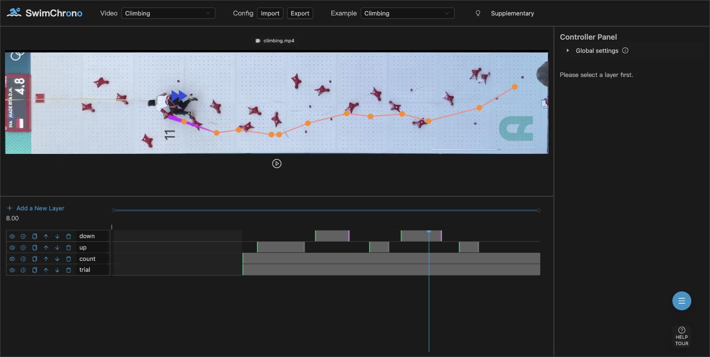

# The Speed-Climbing Case (Experimental)

*SwimChrono* is built for swimming races, but the temporal-arrangement
approach generalizes to other racing sports. This repository ships a
speed-climbing case as an **experimental demonstration** — it is a proof
of concept, not a fully supported sport.

## Try it

1. Run the tool (`yarn run dev`, or use the online version).
2. In the Header, pick **Climbing** in the *Video* dropdown.
3. Load the **Climbing** entry from the *Example* dropdown.
4. Play the video: four layers (*up*, *down*, *count*, *trial*) appear,
   with triggers based on acceleration thresholds.

## What is included

| Asset | Role |
|---|---|
| `public/video/climbing.mp4` | Women's speed-climbing run (MADE RITA D.M., INA), from-above strip view, 60 fps, ~11 s |
| `public/csv/climb_processed.csv` | Per-frame data derived from the event-level annotations |
| `public/configuration/climb.json` | The *Climbing* example: four layers with acceleration-threshold triggers |
| `VisClimbCount` / `VisClimbIcon` / `VisClimbLine` | Climbing-specific visualization components (count text, acceleration icon, trajectory line) |
| `videoMetaDataList` entry `"Climbing"` | Registers the race (single lane, 15 m wall, 60 fps) in `src/utils/values.tsx` |

## Notes and limitations

* The tool models races as swimming lanes; the climbing wall is treated
  as a single 15 m "lane".
* The source data is a sparse, event-level annotation CSV (same
  sportsdata-style format as the swimming annotations) expanded to a
  per-frame table; swimming-specific fields (records, strokes, …) are
  unused.
